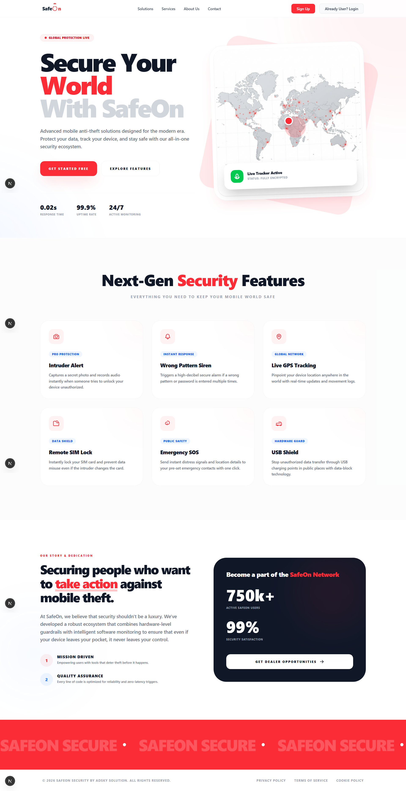
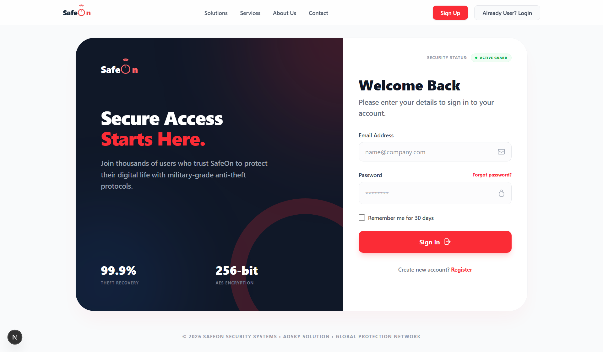
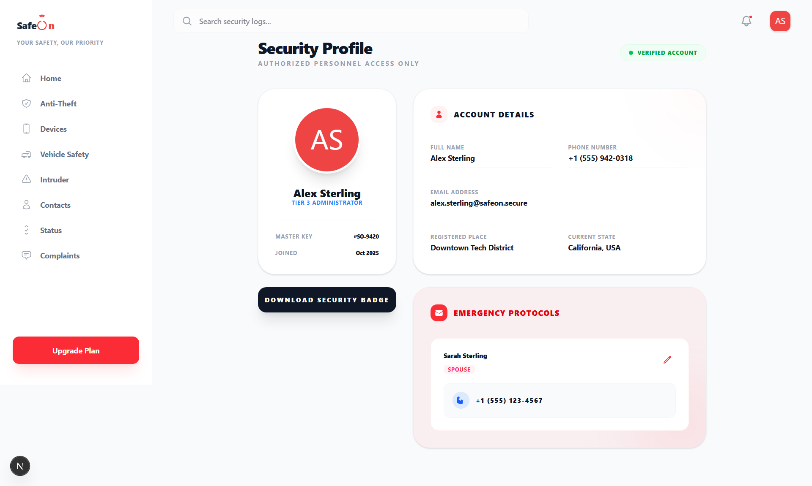
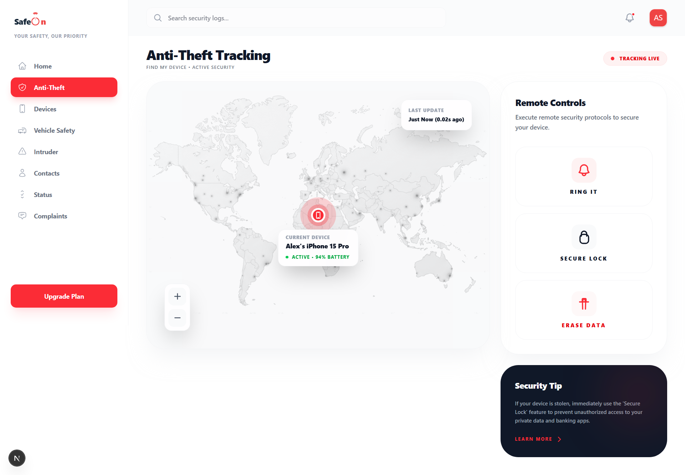
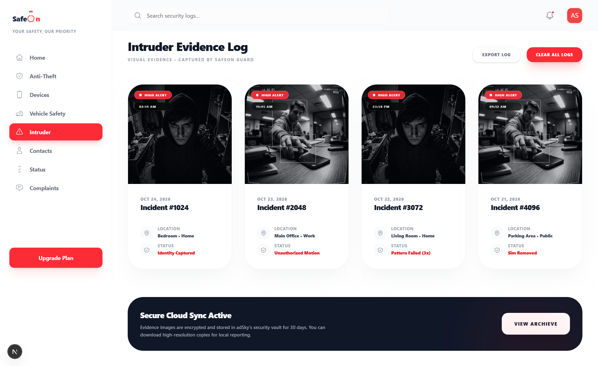
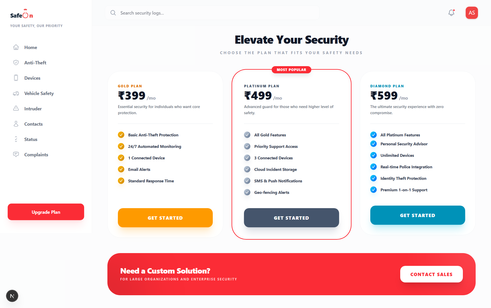

# SafeOn Web Application

**Live Demo:** [https://saftyon.vercel.app/](https://saftyon.vercel.app/)

## Overview & Concept
SafeOn is an advanced web-based security and device management dashboard that serves as the counterpart to the SafeOn mobile app. 

**The Thought Behind the Project:** 
The primary goal of this application is to provide an accessible and powerful control center for remote device security. If your mobile phone gets stolen or lost, you can simply visit this website from any browser, log in securely using your App ID or authorized credentials, and instantly take action. Instead of feeling helpless when losing a device, this web application empowers users to locate their phone, secure their privacy, and gather evidence.

## Key Features
- **Real-Time Location Tracking:** Accurately track the live position of your stolen or lost device on an interactive world map.
- **Remote Controls:** Send immediate commands to your device such as **Ring It**, **Secure Lock**, or remotely **Erase Data** to protect your sensitive banking and personal information.
- **Intruder Evidence Log:** If someone tries to unlock your device unauthorized, the app captures their photo and syncs it to this web dashboard along with the timestamp and location.
- **Security Profile & Emergency Protocols:** Manage your emergency contacts, view your registered details, and maintain your overall device security hygiene.
- **System Health Monitoring:** Get real-time alerts and check the operational status of your connected devices.

## Screenshots Tour

To perfectly showcase the application, save the 7 screenshots you shared into the `public` folder using the filenames listed below, and they will automatically appear here!

### 1. Landing Page
Showcases the platform's comprehensive anti-theft solutions and next-gen security features to new users.


### 2. Login & Authentication
Secure sign-in access for users to enter their credentials and access their stolen or lost device's security dashboard.


### 3. Home / Security Profile & Emergency Protocols
Manage your security profile, view current registered location, and set emergency contacts or protocols.


### 4. Anti-Theft Tracking
The core feature allowing you to find your device's exact location globally and execute immediate remote security protocols (Ring, Lock, Erase).


### 5. Intruder Evidence Log
A visual gallery of unauthorized access attempts automatically captured by the device and securely synced for download or local reporting.


### 6. Security Overview / Dashboard
A comprehensive view of active protections, real-time alerts, and system health status. Users can monitor their global network securely.


### 7. Upgrade Plans
Discover advanced premium features structured across different user tiers (Gold, Platinum, Diamond) depending on security needs.


---

## Technical Details & Getting Started

This is a [Next.js](https://nextjs.org) project.

### Running Locally

First, run the development server:
```bash
npm run dev
# or
yarn dev
# or
pnpm dev
# or
bun dev
```

Open [http://localhost:3000](http://localhost:3000) with your browser to see the result.

This project uses [`next/font`](https://nextjs.org/docs/app/building-your-application/optimizing/fonts) to automatically optimize and load local fonts.
